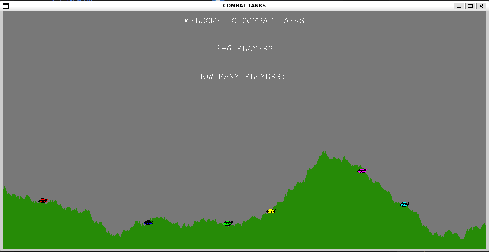

# CombatTanks

CombatTanks is a retro-style multiplayer tank battling game designed for intense and strategic gameplay. Players can control tanks, fire weapons, and compete against each other in a dynamic environment. The game features customizable player names, colors, and various ammunition types, making each match unique and engaging.

## Features

- **Multiplayer Gameplay**: Supports up to 6 players for competitive matches.
- **Customizable Tanks**: Players can choose their tank colors and names.
- **Diverse Ammunition**: Switch between different types of ammo for strategic combat.
- **Interactive Controls**: Use keyboard inputs to move, aim, and fire weapons.
- **Dynamic Gameplay**: Includes health packs, power adjustments, and turn-based mechanics.

## Requirements

To run CombatTanks, ensure you have the following installed:

- `pygame` library (install using `pip install pygame` or `pip install -r requirements.txt`)

## How to Play

1. Type in number of players 2-6.
2. Enter in name and color for each player.

### Controls

- **A** or **<**: Move the barrel direction left.
- **D** or **>**: Move the barrel direction right.
- **Left Arrow**: Move the barrel by 1 degree left.
- **Right Arrow**: Move the barrel by 1 degree right.
- **Up Arrow**: Increase power.
- **Down Arrow**: Decrease power.
- **H**: Use your health pack.
- **W**: Drive in the direction your barrel is facing.
- **1, 2, 3, 4, 5**: Select which missile to use in increasing order of size.
- **Enter**: Fire your missile and end your turn.

